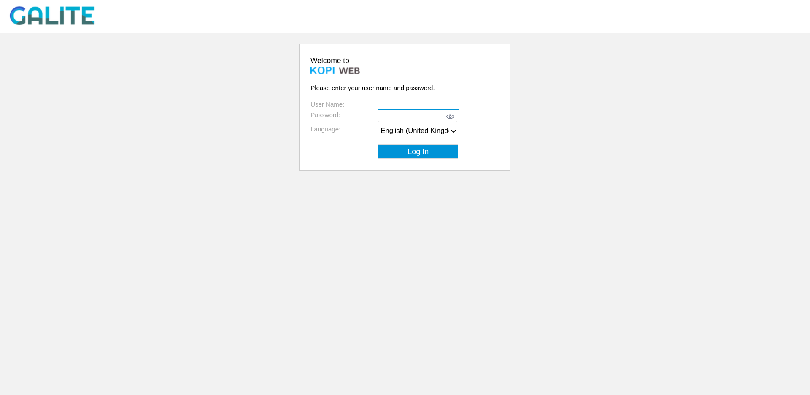
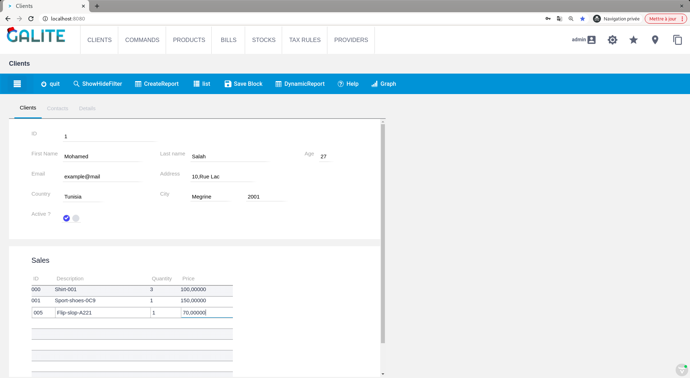
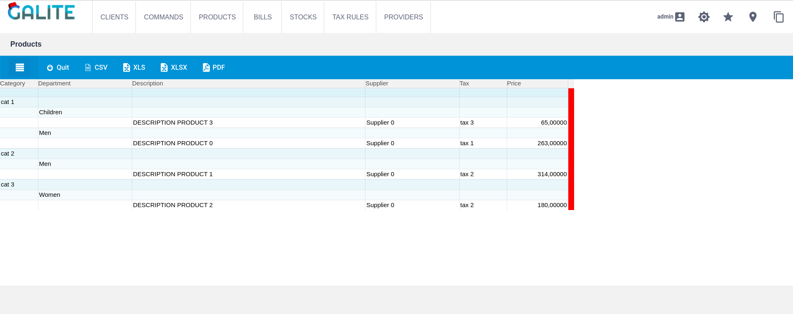
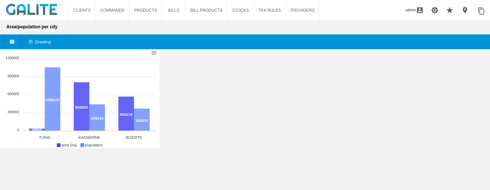

Galite Framework


[](https://maven-badges.herokuapp.com/maven-central/org.kopi/galite-core)

Welcome to **Galite**, the framework of [kopiLeft](https://github.com/kopiLeft) with an expressive elegant syntax based on Kotlin DSL to create great applications.

## Purpose
Since development must be as creative and enjoyable as doing common tasks, Galite provides all the needed tools for developers to take the pain out of designing and implementing applications.

Galite allows users to build business applications with forms, reports and charts using a simple, creative and specific syntax that will allow you to put all the verbosity aside and concentrate on the business logic with its simple domain specific language.

## Advantages
Galite offers many advantages:
* Kotlin-based DSL: using Type-Safe builders for building the application components through the simple declaration of the forms, reports or charts in the DSL.
* Database-backed application: it provides you with the feature of connecting forms with databases and getting queries from different database dialects. You declare the database tables using [Exposed](https://github.com/JetBrains/Exposed) framework.
* Strongly typed fields: you have to declare the data types of fields explicitly, which allows to check the type of data assigned to a field at compile-time.

## Getting started
### Download
If you're using Gradle Kotlin Script, add the following to your build.gradle.kts file:
````KOTLIN
repositories {
  mavenCentral()
}

dependencies {
  implementation("org.kopi", "galite-core", "1.0.1")
}
````

### Running the demo application
Before running the app make sure that you have Java 8 (or higher) JDK installed.

To quickly start the app, type this into your terminal:
```
git clone https://github.com/kopiLeft/Galite.git
cd Galite
./gradlew clean run
```

The app will be running on http://localhost:8080

When the app is started, the login page is displayed. For demo purposes, a user is inserted into the database with the following parameters:
```
login = admin
password = admin
```

To see the code for this app, go to [Demo](galite-demo/galite-vaadin/src/main/kotlin/org/kopi/galite/demo).

## Customize and configure your App
To define your application customizations (logo, locales, .etc) you need to implement the `VApplication` class.

This creates an application developed with [Vaadin](https://vaadin.com/).

Exemple:
````KOTLIN
@Route("")
class MyApp : VApplication(Registry(domain = "GALITE", parent = null)) {

  override val sologanImage get() = "galite-slogan.png"
  
  override val logoImage get() = "galite-logo.png"
  
  override val logoHref get() = "http://[mywebsite]"
  
  override val alternateLocale get() = Locale.UK
  
  override val supportedLocales get() = arrayOf(Locale.UK, Locale.FRANCE, Locale("de", "AT"), Locale("ar", "TN"))

  companion object {
    init {
      ApplicationConfiguration.setConfiguration(ConfigurationManager)
    }
  }

  object ConfigurationManager : ApplicationConfiguration() {
    override val version get(): String = "1.0"
    override val applicationName get(): String = "MyApp"
    override val informationText get(): String = "info"
    override val logFile get(): String = "log.txt"
    override val debugMailRecipient get(): String = "mail@adress"
    override fun getSMTPServer(): String = "smtp.server"
    override val faxServer get(): String = "fax.server"
    override fun mailErrors(): Boolean = false
    override fun logErrors(): Boolean = true
    override fun debugMessageInTransaction(): Boolean = true

    /** And many other configurations. See ApplicationConfiguration.kt */
  }
}
````

> Note: The `Route` annotation allow you to define the navigation URL of your web application.

When starting the application, the login page is displayed. It is provided by default by Galite, so you don't need to create it.


## Form
You should be able to build custom forms fast and efficiently.

Here is a code snippet:
````KOTLIN
class ClientForm : Form(title = "form-title", locale = Locale.UK) {

  val action = menu("Action")

  val helpForm = actor(
    menu = action,
    label = "Help",
    help = " Help"
  ) {
    key = Key.F1      // key is optional here
    icon = Icon.HELP  // icon is optional here
  }
 
  val helpCmd = command(item = helpForm) { 
    showHelp()
  }

  val clientsPage= page("Clients")
  
  val block = clientsPage.insertBlock(Clients()) 
}

class Clients : Block("Clients", 1, 1) {
  val u = table(Client)

  val idClt = visit(domain = LONG(10), position = at(1, 1..2)) {
    label = "ID"
    help = "The client id"
    columns(u.idClt)
  }
  val fstnameClt = visit(domain = STRING(25), position = at(2, 1)) {
    label = "First Name"
    help = "The client first name"
    columns(u.firstNameClt)
  }
  val nameClt = visit(domain = STRING(25), position = at(2, 2)) {
    label = "Last name"
    help = "The client last name"
    columns(u.lastNameClt)
  }
  val ageClt = visit(domain = INT(3), position = at(3, 1)) {
    label = "Age"
    help = "The client age"
    columns(u.ageClt)
  }
  val active = visit(domain = BOOL, position = at(5, 1)) {
    label = "Active ?"
    help = "Is the use account active?"
  }
}
````


## Reports
The report consists of an instance that gets dynamically injected with the data that is inserted by the user. The required data is iteratively fetched from the table to then be formatted within a customizable report.
Reports can be grouped together according to certain attributes (collapse, computations)
The user can generate a file from a report. The file can be in one of the following formats: csv, pdf or excel.
````KOTLIN
class ProductReport : Report(title = "Products", locale = Locale.UK) {

  val action = menu("Action")

  val csv = actor(
    menu = action,
    label = "CSV",
    help = "CSV Format",
  ) {
    key = Key.F8
    icon = Icon.EXPORT_CSV
  }

  val pdf = actor(
    menu = action,
    label = "PDF",
    help = "PDF Format",
  ) {
    key = Key.F9            // key is optional here
    icon = Icon.EXPORT_PDF  // icon is optional here
  }

  val cmdCSV = command(item = csv) { 
    model.export(VReport.TYP_CSV)
  }

  val cmdPDF = command(item = pdf) { 
    model.export(VReport.TYP_PDF)
  }

  val category = field(domain = Category) {
    label = "Category"
    help = "The product category"
    group = department
  }

  val department = field(domain = STRING(20)) {
    label = "Department"
    help = "The product department"
    group = description
  }

  val description = field(domain = STRING(50)) {
    label = "Description"
    help = "The product description"
    format { value ->
      value.toUpperCase()
    }
  }

  val supplier = field(domain = STRING(20)) {
    label = "Supplier"
    help = "The supplier"
  }

  val taxName = field(domain = STRING(10)) {
    label = "Tax"
    help = "The product tax name"
  }

  val price = field(domain = DECIMAL(10, 5)) {
    label = "Price"
    help = "The product unit price excluding VAT"
  }

  init {
    transaction {
      Product.selectAll().forEach { result ->
        add {
          this[description] = result[Product.description]
          this[department] = result[Product.department]
          this[supplier] = result[Product.supplier]
          this[category] = result[Product.category]
          this[taxName] = result[Product.taxName]
          this[price] = result[Product.price]
        }
      }
    }
  }
}

object Category : CodeDomain<Int>() {
  init {
    "shoes" keyOf 1
    "shirts" keyOf 2
    "glasses" keyOf 3
    "pullovers" keyOf 4
    "jeans" keyOf 5
  }
}
````


## Charts
If further analysis is needed, the user can generate charts to visualize data and draw conclusions from the observed patterns.
There exist different types of charts such as pie, bar, column, line and area charts.
Charts are essential to the decision-making process and for speculation.
The user will be able to select the required data along with the chart’s dimensions and measures.

````KOTLIN
class ChartSample: Chart(
  title = "area/population per city",
  help = "This chart presents the area/population per city",
  locale = Locale.UK
) {

  val action = menu("Action")

  val area = measure(DECIMAL(width = 10, scale = 5)) {
    label = "area (ha)"

    color {
      VColor.BLUE
    }
  }

  val population = measure(LONG(10)) {
    label = "population"
  }

  val city = dimension(STRING(10)) {
    label = "dimension"

    format { value ->
      value?.toUpperCase()
    }
  }

  val type = trigger(CHARTTYPE) {
    VChartType.BAR
  }

  init {
    city.add("Tunis") {
      this[area] = Decimal("34600")
      this[population] = 1056247
    }

    city.add("Kasserine") {
      this[area] = Decimal("806600")
      this[population] = 439243
    }

    city.add("Bizerte") {
      this[area] = Decimal("568219")
      this[population] = 368500
    }
  }
}
````


## Contributing
All contributions are welcome.

If the idea excites you and you want to add a new patch or feature, feel free to submit a pull request.

If you have any questions, you can create a question issue.

## License

Galite framework is licensed under the LGPLv2.1. See [COPYING](COPYING)
