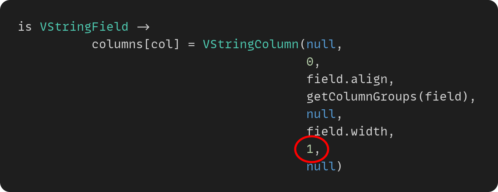
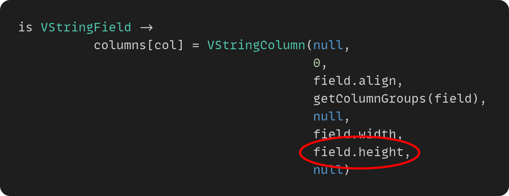
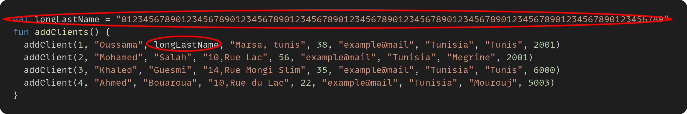
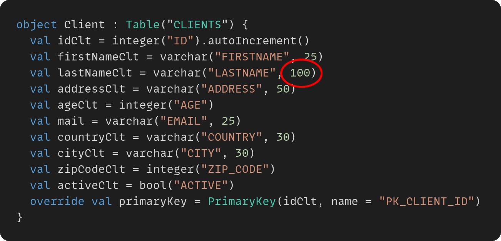
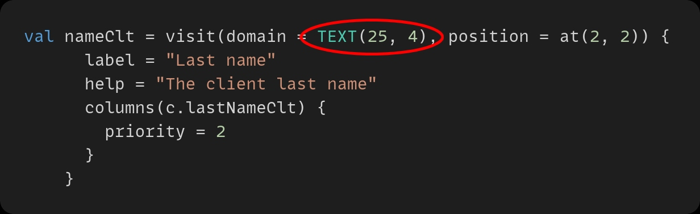
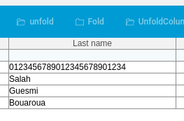
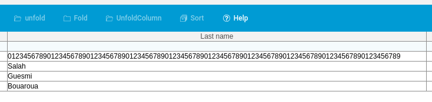

[.text-justify]
= Dossier APPS-01ON - Conception
Lars Vogel(c) 2016 vogella GmbH
Version 0.3, 17.05.2021
:sectnums:
:toc:
:toclevels: 4
:toc-title: Table des matières

== Problème
[.text-justify]
Lors de l'appel du rapport dynamique à partir de la page du formulaire, on remarque que les colonnes ayant du contenu de type `TEXT` sont *limitées à un certain nombre de caractères*.

C'est-à-dire, si une case contient un texte de 50 caractères, et si la colonne est limitée à 30 caractères, on va voir seulement les 30 premiers caractères, et le reste des 20 caractères disparaît.

== Prospection
[.text-justify]
Afin de comprendre la source du problème, on est allé à la fonction `createDynamicReport()`.

Cette fonction appartient à la classe `VDynamicReport` qui gère tout ce qui est relié aux rapports dynamiques.

Cette classe contient aussi la fonction `initColumns()` qui crée les colonnes du rapport et les remplit avec les données.

On a remarqué que, dans le cas oû notre champ est du type `TEXT`, la colonne reçoit le `width` du champ, mais ait *un `height` qui est égal à `1` au lieu du `height` du champ.*

On note qu'il existe le type `STRING` qui est un type mono-ligne par défaut et qui souffre du même problème dans le cas où on veut l'utiliser au lieu de `TEXT`.

== Solution Proposée
[.text-justify]
La solution, bien évidemment, est de changer ce `height` à *une valeur variable*, qui prend le `height` du champ, au lieu de *la constante* `1`.

En pratique, on a créé la branche `galite-01ON`, et on a fait ce petit changement dans le fichier `VDynamicReport.tk` à la ligne 173.

===== Avant

===== Après

Le changement ce fait dans la fonction `initColumns()`, qui crée les colonnes et les remplis, et en particulier quand le champ est un `TEXT` ou `STRING`. Par défaut, le `height` avec le type `STRING` est égal à `1`.

== Test

Le test peut se faire d'une manière directe et efficace.

D'abord, on ajoute une chaine de caractères de longueur `100` dans la base des données de test dans le fichier `Migration.kt`.

Ensuite, on change la longueur de ce champ à `100` aussi dans la définition des tables de la base des données dans le fichier `Tables.kt`. Ceci est fait afin qu'on n'aura pas d'erreur de compilation, car il ne faut pas dépasser la limite définit dans la table de la base des données.

Et finalement, on définit notre champ comme suit dans le fichier concerné. Dans notre cas, c'est le fichier `CLientForm.kt`.

Et bien sûr, il ne faut pas oublier l'importation de la classe `TEXT` si nécessaire.

[source,kotlin]
----
import org.kopi.galite.visual.domain.TEXT
----

Ceci est l'output du boutton `Dynamic Report` avant la solution proposée.

Ceci est l'output du même boutton après la solution proposée.

On remarque évidemment que le champ était limité à seulement `25` caractères; `25` étant le `width` du champ `TEXT` définit en haut. Mais, après l'affection de la solution, le champ est élargie à `100` qui est le `width * height`.