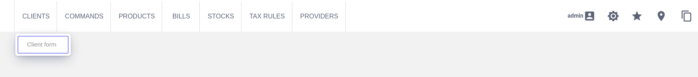

## Galite Testing

Galite testing gives you the ability to unit test your Galite application. It's based on [Karibu-Testing](https://github.com/mvysny/karibu-testing): the vaadin unit testing library.

### Simulating the login to the application

To test the application functionalities you need first to login using `login(userName, password)`.
> Note: you can use a user that has access to all your application modules to be able to test all your functionalities

### Launching a module

The main page of the application contains the menu of the available modules.
#### Example:


To open a form, galite testing provides two functions:
```
Form.open()
```
or

```
openForm(formCaption, duration)

parameters:
  formCaption: the form name displayed in the menu.
  duration: how much time it takes to open the form.
```

Example:

Open the first form in the [menu](#example). Opening this form should take less than 200 ms.

```
openForm("Client form", 200)
```
> `Form.open()` automatically lookup the formCaption in all menus. If the form belongs to many menus you can use `Form.open(menu)`. 
### Triggering a command

To simulate a click on an actor, which triggers a command action, you can use `Actor.triggerCommand(duration)`. The `duration` parameter represents how much time it takes for the command to finish its action.
